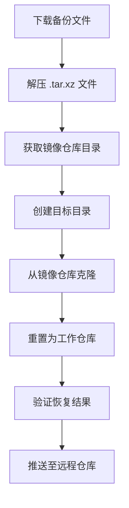

# 如何从 GitHub 备份恢复仓库

本教程将指导您如何从通过 GitHub Actions 创建的备份中恢复仓库。这些备份采用高度压缩的 `.tar.xz` 格式，包含完整的 Git 仓库镜像。

## 备份文件结构

备份文件命名格式为：`owner-repo-YYYYMMDDHHMMSS.tar.xz`

例如：
```
clashdownload-Clash-20250623040445.tar.xz
```

这些文件包含：
- 完整的 Git 仓库镜像（使用 `git clone --mirror` 创建）
- 所有分支、标签和提交历史
- 仓库配置信息

## 恢复步骤

### 1. 下载备份文件

1. 在 GitHub 仓库中，转到 "Releases" 部分
2. 找到包含您需要恢复的仓库的备份版本
3. 下载对应的 `.tar.xz` 文件

### 2. 准备恢复环境

确保您的系统已安装必要的工具：

```bash
# 对于 Ubuntu/Debian
sudo apt-get update
sudo apt-get install -y xz-utils git

# 对于 macOS (使用 Homebrew)
brew install xz git
```

### 3. 解压备份文件

```bash
# 创建恢复目录
mkdir restore
cd restore

# 解压备份文件（替换为您的文件名）
tar xf /path/to/clashdownload-Clash-20250623040445.tar.xz
```

解压后，您将得到一个镜像仓库目录（名称类似 `clashdownload-Clash`）

### 4. 从镜像仓库恢复普通仓库

镜像仓库是裸仓库（bare repository），需要转换为普通工作仓库：

```bash
# 创建目标目录
mkdir my-restored-repo
cd my-restored-repo

# 从镜像仓库克隆
git clone --mirror ../clashdownload-Clash .git
git config --bool core.bare false
git reset --hard
```

### 5. 验证恢复结果

```bash
# 检查仓库状态
git status

# 查看提交历史
git log --oneline

# 查看所有分支
git branch -a

# 查看所有标签
git tag
```

### 6. 恢复特定分支或标签

如果需要恢复到特定时间点：

```bash
# 检出特定分支
git checkout main

# 或检出特定标签
git checkout v1.0.0

# 创建新分支基于某个提交
git checkout -b new-feature abc1234
```

## 完整恢复脚本

以下脚本自动化恢复过程：

```bash
#!/bin/bash

# 设置变量
BACKUP_FILE="clashdownload-Clash-20250623040445.tar.xz"
TARGET_DIR="restored-repo"

# 步骤1: 解压备份
mkdir restore
tar xf "$BACKUP_FILE" -C restore

# 步骤2: 获取镜像目录名
MIRROR_DIR=$(find restore -maxdepth 1 -type d -name "clashdownload-Clash*" | head -1)

# 步骤3: 创建目标目录
mkdir -p "$TARGET_DIR"
cd "$TARGET_DIR"

# 步骤4: 恢复仓库
git init
git remote add origin "../$MIRROR_DIR"
git fetch --all
git reset --hard origin/main  # 替换为您的默认分支

# 步骤5: 清理临时文件
cd ..
rm -rf restore

echo "✅ 仓库已成功恢复到: $TARGET_DIR"
```

## 恢复私有仓库

如果恢复的是私有仓库，需要重新设置认证：

```bash
# 更新远程 URL 使用您的凭据
git remote set-url origin https://<USERNAME>:<TOKEN>@github.com/owner/repo.git

# 推送恢复的仓库
git push --all
git push --tags
```

## 常见问题解决

### 问题1: 解压失败
**错误信息**：`tar: Unrecognized archive format`
**解决方案**：
```bash
# 确保安装了正确的工具
sudo apt-get install xz-utils  # Ubuntu/Debian
brew install xz                # macOS
```

### 问题2: Git 报告无效仓库
**错误信息**：`fatal: not a git repository`
**解决方案**：
```bash
# 确保正确执行了恢复步骤
git init
git remote add origin /path/to/mirror-repo
git fetch --all
```

### 问题3: 恢复后文件缺失
**可能原因**：未正确执行 `git reset --hard`
**解决方案**：
```bash
cd your-repo
git reset --hard HEAD
```

### 问题4: 历史记录不完整
**解决方案**：
```bash
# 获取所有历史记录
git fetch --all --prune --tags
```

## 最佳实践

1. **定期验证备份**：每季度测试恢复过程
2. **保留多个版本**：保留至少 3 个历史备份
3. **异地存储**：将重要备份复制到其他存储服务
4. **加密敏感数据**：恢复后检查并更新所有凭证
5. **文档记录**：维护恢复过程的详细文档

## 恢复流程图



通过遵循本教程，您可以成功从 GitHub 备份中恢复任何仓库。如果您遇到任何问题，请参考备份仓库的 GitHub Actions 日志以获取更多调试信息。
