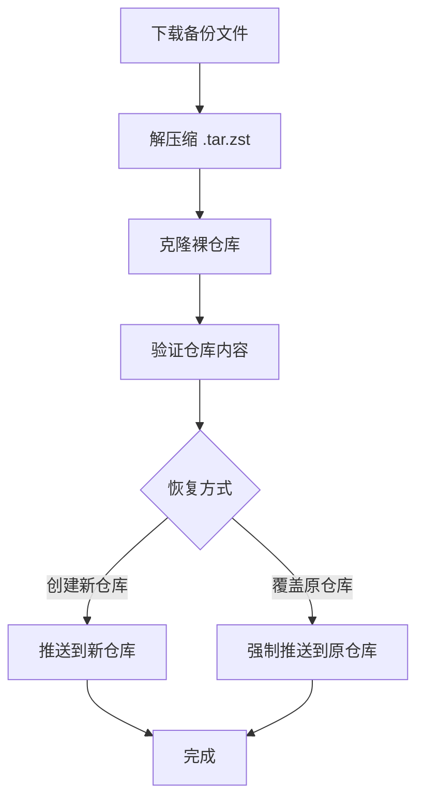

## 如何从 GitHub 备份恢复仓库

以下是从 GitHub 备份恢复仓库的完整指南。备份文件通常是 `.tar.zst` 格式的压缩包，包含完整的 Git 裸仓库（bare repository）。

### 前提条件
1. 已安装 Git
2. 已安装 Zstandard (`zstd`) 压缩工具
3. 拥有备份文件（从 GitHub Releases 下载）

---

### 恢复步骤

#### 1. 下载备份文件
从 GitHub Releases 下载备份的压缩文件（通常命名为 `owner-repo-timestamp.tar.zst`）

```bash
# 示例：下载备份文件
gh release download --pattern "*.tar.zst"
```

#### 2. 解压缩备份文件

```bash
# 创建恢复目录
mkdir restore && cd restore

# 解压缩 .tar.zst 文件
zstd -d < ../owner-repo-timestamp.tar.zst | tar xf -
```

#### 3. 从裸仓库克隆到工作目录

```bash
# 克隆裸仓库到新的工作目录
git clone owner-repo.git workdir
cd workdir
```

#### 4. 验证仓库内容
检查仓库历史记录和文件是否完整：

```bash
# 查看提交历史
git log --oneline

# 检查文件状态
git status

# 查看分支
git branch -a
```

#### 5. 推送到新的 GitHub 仓库
在 GitHub 创建新仓库后推送：

```bash
# 添加新远程仓库
git remote add origin https://github.com/your-username/new-repo.git

# 推送所有分支和标签
git push origin --all
git push origin --tags
```

#### 6. 恢复原始状态（可选）
如果需要恢复原始仓库（而非创建新仓库）：

```bash
# 强制推送到原始仓库（谨慎使用！）
git push --force origin --all
git push --force origin --tags
```

> ⚠️ 警告：这会覆盖远程仓库的历史记录，仅在你确定要覆盖时使用

---

### 完整恢复脚本

```bash
#!/bin/bash

# 输入参数
BACKUP_FILE="owner-repo-1750786800.tar.zst"
NEW_REPO_URL="https://github.com/your-username/new-repo.git"

# 步骤 1: 解压备份
echo "解压备份文件..."
mkdir restore && cd restore
zstd -d -c ../$BACKUP_FILE | tar xf -

# 步骤 2: 获取仓库名称
REPO_DIR=$(find . -maxdepth 1 -type d -name "*.git" | head -n1)
REPO_NAME=$(basename $REPO_DIR .git)

# 步骤 3: 克隆到工作目录
echo "克隆仓库..."
git clone $REPO_DIR $REPO_NAME-workdir
cd $REPO_NAME-workdir

# 步骤 4: 设置新远程
echo "设置新远程仓库..."
git remote add new-origin $NEW_REPO_URL

# 步骤 5: 推送所有内容
echo "推送仓库..."
git push new-origin --all
git push new-origin --tags

echo "恢复完成！访问仓库: $NEW_REPO_URL"
```

---

### 常见问题解决

#### 问题 1：压缩文件损坏
```bash
# 尝试修复压缩文件
zstd --fix ../backup-file.tar.zst -o fixed-backup.tar.zst
```

#### 问题 2：缺少 zstd 工具
```bash
# Linux (Debian/Ubuntu)
sudo apt install zstd

# macOS (Homebrew)
brew install zstd

# Windows (Scoop)
scoop install zstd
```

#### 问题 3：恢复特定分支
```bash
# 列出所有分支
git branch -a

# 恢复特定分支
git checkout -b feature-branch origin/feature-branch
```

#### 问题 4：恢复特定时间点
```bash
# 查找提交ID
git log --oneline

# 重置到特定提交
git reset --hard <commit-id>
```

---

### 恢复流程图



### 最佳实践
1. **定期测试恢复**：每季度测试备份恢复流程
2. **版本保留**：保留至少 3 个历史备份版本
3. **异地存储**：将备份存储在不同地理位置
4. **加密敏感数据**：对包含敏感信息的仓库使用加密备份
5. **文档记录**：维护恢复流程文档

> 💡 提示：使用 `git fsck` 命令验证仓库完整性，确保所有对象都有效

通过以上步骤，您可以可靠地从 GitHub 备份中恢复任何仓库。整个过程保留了完整的提交历史、分支和标签信息，确保仓库恢复到备份时的完整状态。
